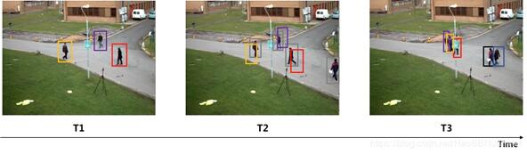
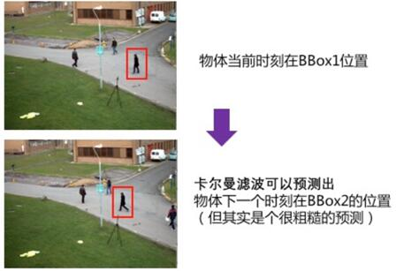
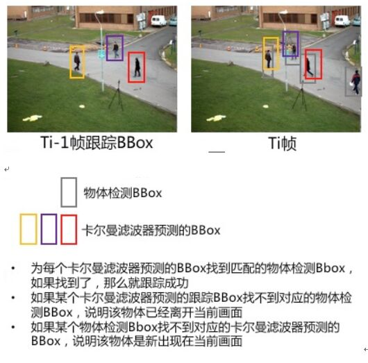
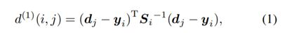

# SIMPLE ONLINE AND REALTIME TRACKING WITH A DEEP ASSOCIATION METRIC——论文笔记

## 概述

Deep Sort是MOT中属于tracking-by-detection 类的跟踪方法，在Sort目标追踪基础上进行了改进。引入了在行人重识别数据集上离线训练的深度学习模型，在实时目标追踪过程中，提取目标的表观特征进行最近邻匹配，可以改善有遮挡情况下的目标追踪效果。同时，也减少了目标ID跳变的问题。

## 问题描述
先简单看下SORT跟踪算法到底在干什么？（以单目标跟踪为例说明如下）
 
- 假设T1时刻成功跟踪了某个单个物体，ID为1，绘制物体跟踪BBox（紫色）。
- T2时刻物体检测BBox总共有4个（黑色），预测T2时刻物体跟踪的BBox（紫色）有1个，解决紫色物体跟踪BBox如何与黑色物体检测BBox关联的算法，就是SORT物体跟踪算法要解决的核心问题。
- SORT关联两个BBox的核心算法是：用IOU计算Bbox之间的距离 + 匈牙利算法选择最优关联结果。 

在目标跟踪中主要包括物体检测与物体跟踪两大部分：
物体检测是对每一帧图片检测出目标物体的坐标位置；物体跟踪是把物体跟踪预测的BBox与物体检测的BBox关联，然后用对应的物体检测BBox代表成功跟踪的BBox结果。

物体跟踪以上图为例：
T1时刻已经成功跟踪了3个目标(不同颜色的BBox代表不同的物体ID)；
T2时刻除了所有物体检测的新位置BBox（灰色），还要物体跟踪预测的Bbox（非灰的其它不同颜色BBox）与物体检测Bbox（灰色）关联，从而分辨出哪一个物体跟踪的Bbox对应哪一个物体检测的BBox，从而产生T2时刻的物体跟踪BBox结果（包括新增物体跟踪器跟踪T2中新检测到的物体）；
T3时刻如果被追踪的物体发生了遮挡(红框BBox的物体)，那么要继续能找到该物体并追踪 (避免ID Switch) 。

## SORT算法的流程

### 1.目标检测     
使用Faster-RCNN进行detection 
### 2.数据关联
  - 2.1 加载检测序列的检框数据，格式为[x,y,w,h,c]，更新为[x1,y1,x2,y2,c]，记为dets;
  - 2.2 根据检测框新轨迹，输出为[x1,y1,x2,y2,ID]
     
	卡尔曼滤更波对当前帧的Bbox进行预测，输出是[x1,y1,x2,y2,0],记为trks；

  - 2.3 将检测分配给跟踪对象—计算两个Bbox之间的IOU，调用linear_assignment进行匹配。

### 3.Track的建立和删除
  - 用指定的检测更新匹配的跟踪器
  - 为未匹配到的检测创建初始轨
  - 删除死亡轨迹

#### 什么是卡尔曼滤波？
	卡尔曼滤波可以对物体下一步的走向做出有根据的预测，即使伴随着各种干扰，卡尔曼滤波总能指出最真实发生的情况。

 其实SORT算法实在卡尔曼滤波的基础上+匈牙利算法将卡尔曼滤波预测的BBOX与物体检测BBOX进行了匹配，选择了合适的物体检测BBOX作为下一时刻的物体跟踪bbox。

	（卡尔曼滤波预测的BBOX只是作一个参考作用，根据这个预测的BBOX找到和它最接近的BBOX作为轨迹的下一帧所在的位置）

## Deep SORT

在SORT中，进行目标匹配的关联度量是卡尔曼滤波预测的BBOX与物体检测BBOX两个bbox之间的IOU，是一个很粗糙的跟踪算法，而Deep SORT用一种结合运动与外观信息的更具有信息量的度量来代替SORT中的关联度量。
在论文中需要注意的几点包括：

 - 在计算detections和tracks之间的匹配程度时，使用了融合的度量方式。包括卡尔曼滤波中预测位置和观测位置在马氏空间中的距离 和 bbox之间表观特征的余弦距离。
 - 其中bbox的表观特征是通过一个深度网络得到的128维的特征。
 - 在匈牙利匹配detections和tracks时，使用的是级联匹配的方式。这里要注意的是，并不是说级联匹配的方式就比global assignment效果好，而是因为本文使用kalman滤波计算运动相似度的缺陷导致使用级联匹配方式效果更好。

### 轨迹处理和状态估计
#### 状态估计：
使用一个8维空间去刻画轨迹在i时刻的状态(u, v, γ, h, x,˙ y,˙ γ, ˙ h˙) ,分别表示bounding box中心的位置、纵横比、高度、以及在图像坐标中对应的速度信息。然后使用一个kalman滤波器预测更新轨迹，其检测结果为 (u, v, γ, h) 。
#### 轨迹处理：
这个主要说轨迹什么时候终止、什么时候产生新的轨迹。 

- 首先对于每条轨迹都有一个阈值a用于记录轨迹从上一次成功匹配到当前时刻的时间。当该值大于提前设定的阈值则认为改轨迹终止，直观上说就是长时间匹配不上的轨迹认为已经结束。
- 在匹配时，对于没有匹配成功的detections都认为可能产生新的轨迹。但由于这些detections可能是一些假性检测（如公交站牌、垃圾桶），所以对这种情形新生成的轨迹标注状态'tentative' ,然后观查在接下来的连续若干帧（论文中是3帧）中是否连续匹配成功，是的话则认为是新轨迹产生，标注为'confirmed',否则则认为是假性轨迹,状态标注为'deleted'。

### 匹配
匹配自然是指当前有效的轨迹和当前的detections之间的匹配。所谓有效的轨迹是指那些还存活着的轨迹，即状态为tentative和confirmed的轨迹。轨迹和detection之间的匹配程度结合了运动信息和表观信息。

#### 运动匹配度
用Mahalanobis距离（马氏距离）来表示第j个检测和第i条轨迹之间的运动匹配程度。

dj表示第j个detection的状态(u, v, γ, h) ;

yi是轨迹在当前时刻的预测观测量（kalman滤波预测得到的）；

Si是表示检测位置与平均追踪位置之间的协方差矩阵，由kalman滤波器预测得到的；

考虑到运动的连续性，可以通过该马氏距离对detections进行筛选，文中使用卡方分布的0.95分位点作为阈值，如果马氏距离小于该阈值，代表成功匹配。定义如下示性函数：

#### 表观匹配度

单独使用马氏距离最为匹配度度量会导致IDSwitch等情形严重，特别的当相机运动时可能导致马氏距离度量失效，所以这个时候应该靠表观匹配度补救。

对于每一个detection，包括轨迹中的detections，使用reid模型抽出得到一个128维的特征向量||r||，然后使用detection和轨迹包含的detections的特征向量之间的最小余弦距离作为detection和track之间的表观匹配程度。

当然轨迹太长导致表观产生变化，在使用这种最小距离作为度量就有风险， 所以文中只对轨迹的最新的  之内detections进行计算最小余弦距离。

计算的是余弦相似度，而余弦距离=1-余弦相似度，范围是[0,2]。

#### 综合匹配度——通过运动模型和外观模型的加权得到

其中 是超参数，用于调整不同项的权重。

### 级联匹配

#### 为什么采用级联匹配？

当一个目标被遮挡很长时间，Kalman滤波的不确定性就会大大增加，在计算马氏距离的时候，用到的是Kalman滤波协方差的倒数，连续的预测不更新就会导致这个空间协方差越来越大，因此，马氏距离值会增加。比如：现在有两条轨迹竞争同一个detection，那么那条遮挡时间长的往往得到马氏距离更小，使detection倾向于分配给丢失时间更长的轨迹，但是直观上，该detection应该分配给时间上最近的轨迹。
为了解决该问题，论文采用级联匹配的策略来提高匹配精度,它优先于更常见的对象。这样每次分配的时候考虑的都是遮挡时间相同的轨迹，就不存在上面说的问题了。具体的算法如下:

T是物体跟踪集合

D是物体检测集合

- 1.C矩阵存放所有物体跟踪i与物体检测j之间距离的计算结果
- 2.B矩阵存放所有物体跟踪i与物体检测j之间是否关联的判断(0/1)
- 3.关联集合M初始化为{}
- 4.将找不到匹配的物体检测集合初始化为D
- 5.从刚刚匹配成功的跟踪器循环遍历到最多已经有Amax 次没有匹配的跟踪器
- 6.选择满足条件的跟踪器集合Tn
- 7.根据最小成本算法计算出Tn与物体检测j关联成功产生集合[xi,j]
- 8.更新M为匹配成功的（物体跟踪i，物体检测j） 集合
- 9.从U中去除已经匹配成功的物体检测j
- 10.循环
- 11.返回 M U 两个集合，分别表示匹配集合和非匹配集合。

## 深度表观描述子网络
预训练的网络时一个在大规模ReID数据集上训练得到的，这个ReID数据集包含1261个人的1100000幅图像，使得学到的特征很适合行人跟踪。

然后使用该预训练网络作为基础网络，构建wide ResNet，用来提取bounding box的表观特征，网络结构如下：

该网络在Nvidia GeForce GTX 1050 mobile GPU下提出32个bounding boxes大约花费30ms，显然可以满足实时性要求。

## 实验
### 实验设置和实验结果
实验是在MOT16数据集上跑的，使用的detections并非公共检测结果。而是参考文献1中提供的检测结果. 实验结果如下表所示。

## 结论

- 1.相对于没使用深度表观特征的原始sort方法，IDSw下降了约45%，可见该深度表观特征的有效性。
- 2.由于表观特征的使用，使轨迹因遮挡导致的motion 信息没用时不至于错误分配detection，使得ML更少，MT更多。
- 3.该方法存在的一个问题使FP太大，论文中分析原因有两点。一方面是detections问题，另一方面是轨迹最大允许丢失匹配的帧数太大导致很多假性目标被分配到轨迹中。提高detections的置信度可以显著提升性能。
- 4.速度够快，20Hz

