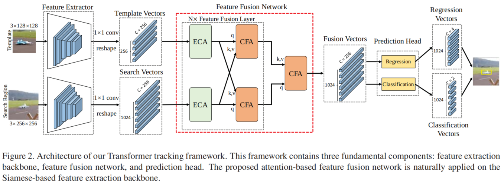
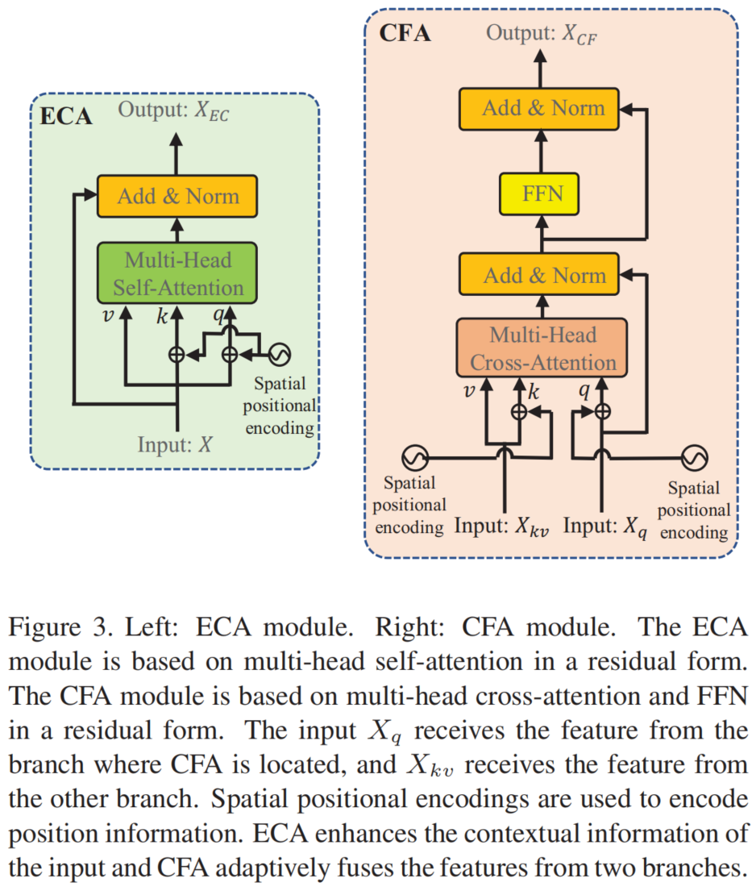
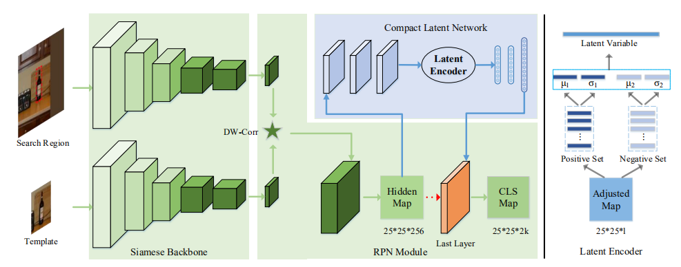
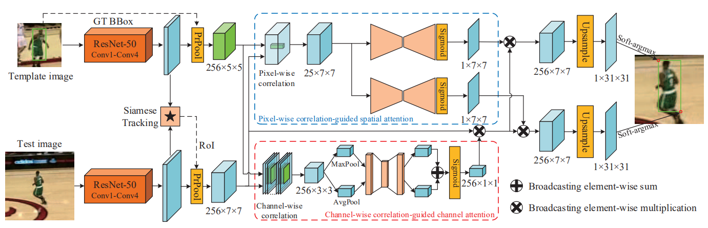
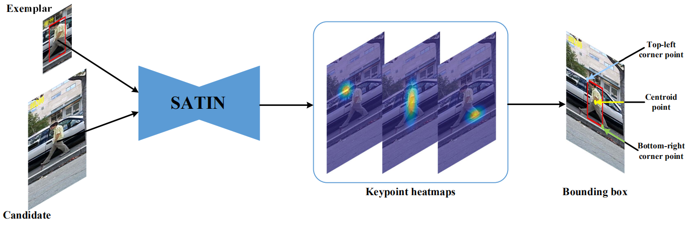

## List of paper

#### CVPR2021
- Xin Chen, Bin Yan, Jiawen Zhu, Dong Wang, Xiaoyun Yang and Huchuan Lu. Transformer Tracking.   
paper: https://arxiv.org/pdf/2103.15436  
code: https://github.com/chenxin-dlut/TransT  
Transformer结合目标跟踪，做self attention和cross attention。self attention作用于backbone的输出特征，做自我特征的增强。cross attention代替互相关操作，对template和search分支做匹配。速度：50fps on GPU。
  
  

- Ning Wang, Wengang Zhou, Jie Wang, Houqiang Li. Transformer Meets Tracker: Exploiting Temporal Context for Robust Visual Tracking. 
paper: https://arxiv.org/pdf/2103.11681.pdf  
code: https://github.com/594422814/TransformerTrack  
分解了Transformer中的Encoder和Decoder模块，encoder做模板的特征增强（包括多帧template的融合），decoder负责template和search之间的信息传递。  
  

#### ECCV2020
- Goutam Bhat, Martin Danelljan, Luc Van Gool, Radu Timofte. Know Your Surroundings: Exploiting Scene Information for Object Tracking. 

- **CLNet:** Xingping Dong, Jianbing Shen, Ling Shao, Fatih Porikli. A Compact Latent Network for Fast
Adjusting Siamese Trackers.
code: https://github.com/xingpingdong/CLNet-tracking
在SiamRPN++的基础上，加入sequence-specific信息调整离线训练的模型，达到discrimination能力的提高。只在第一帧对基础模型进行调整，而非在线更新，因此减少了time cost。

在测试时，CLNet模块用第一帧图片来计算正样本和负样本的方差和均值，用方差和均值计算权重，微调SiamRPN++最后一层的权重，使模型适合特定序列。

- **PG-Net:** Bingyan Liao, Chenye Wang, Yayun Wang, Yaonong Wang, Jun Yin. Pixel to Global Matching Network for Visual Tracking.

#### CVPR2020
- **Retina-MAML:** Guangting Wang, Chong Luo, Xiaoyan Sun, Zhiwei Xiong, Wenjun Zeng. Tracking by Instance Detection: A Meta-Learning Approach. (oral)
- **PrDiMP:** Martin Danelljan, Luc Van Gool, Radu Timofte. Probabilistic Regression for Visual Tracking.
code: https://github.com/visionml/pytracking
- **SiamAttn:** Yuechen Yu, Yilei Xiong, Weilin Huang, Matthew R. Scott. Deformable Siamese Attention Networks for Visual Object Tracking.
- **SiamBAN:** Zedu Chen, Bineng Zhong, Guorong Li, Shengping Zhang, Rongrong Ji. Siamese Box Adaptive Network for Visual Tracking.
code: https://github.com/hqucv/siamban
- Mingjie Sun,  Jimin Xiao,  Eng Gee Lim, Bingfeng Zhang, Yao Zhao. Fast Template Matching and Update for Video Object Tracking and Segmentation.
使用RL进行决策：1.使用IOU-based match或者appearance-based match；2.是否用当前帧更新target template。
- Kenan Dai, Yunhua Zhang, Dong Wang,  Jianhua Li, Huchuan Lu, Xiaoyun Yang. High-Performance Long-Term Tracking with Meta-Updater.
用元学习集成集合、判别、外观信息，用LSTM挖掘序列信息，指导跟踪器的更新。
code: https://github.com/Daikenan/LTMU

- **CGACD**: Fei Du, Peng Liu, Wei Zhao, Xianglong Tang. Correlation-Guided Attention for Corner Detection Based Visual Tracking.

一个two-stage的检测器，先用Siamese回归出一个粗略的包围框，然后用角点进行精确定位。角点检测的基础上加入了互相关引导的通道注意力和空间注意力。

#### AAAI2020
- **GlobalTrack:** Lianghua Huang, Xin Zhao, Kaiqi Huang. GlobalTrack: A Simple and Strong Baseline for Long-term Tracking.
code: https://github.com/huanglianghua/GlobalTrack
- **SiamFC++:** Yinda Xu, Zeyu Wang, Zuoxin Li, Yuan Ye, Gang Yu. "SiamFC++: Towards Robust and Accurate Visual Tracking with Target Estimation Guidelines."
code: https://github.com/MegviiDetection/video_analyst

#### ICCV2019
- **DiMP:** Goutam Bhat, Martin Danelljan, Luc Van Gool, Radu Timofte. "Learning Discriminative Model Prediction for Tracking."
code: https://github.com/visionml/pytracking
更新模块：
    - model initializer：只用目标区域内的特征初始化模型权重，由一个卷积层和一个PrPooling层构成，生成4*4\*n的特征
    - model optimizer：结合背景信息优化模型权重
    - target model f尺寸：4*4
    - 离线训练：视频序列中的随机样本进行训练（从某一帧及前面抽取3帧作为train set，该帧后面抽取三帧作为test set）
- **UpdateNet:** Lichao Zhang, Abel Gonzalez-Garcia, Joost van de Weijer, Martin Danelljan, Fahad Shahbaz Khan. "Learning the Model Update for Siamese Trackers."
code:https://github.com/zhanglichao/updatenet
- **GradNet:** Peixia Li, Boyu Chen, Wanli Ouyang, Dong Wang, Xiaoyun Yang, Huchuan Lu. "GradNet: Gradient-Guided Network for Visual Object Tracking."(oral)
code: https://github.com/LPXTT/GradNet-Tensorflow

#### CVPR2019
- **SPM:** Guangting Wang, Chong Luo, Zhiwei Xiong, Wenjun Zeng. SPM-Tracker: Series-Parallel Matching for Real-Time Visual Object Tracking. 
- **ATOM:** Martin Danelljan, Goutam Bhat, Fahad Shahbaz Khan, Michael Felsberg. ATOM: Accurate Tracking by Overlap Maximization.(oral)
code: https://github.com/visionml/pytracking.
- **TADT:** Xin Li, Chao Ma, Baoyuan Wu, Zhenyu He, Ming-Hsuan Yang. "Target-Aware Deep Tracking"
code: https://github.com/XinLi-zn/TADT
- **SiamRPN++:** Bo Li, Wei Wu, Qiang Wang, Fangyi Zhang, Junliang Xing, Junjie Yan. "SiamRPN++: Evolution of Siamese Visual Tracking with Very Deep Networks."(oral)
code: https://github.com/STVIR/pysot

#### ECCV2018
- **DaSiamRPN:** Zheng Zhu, Qiang Wang, Bo Li, Wei Wu3, Junjie Yan,and Weiming Hu. "Distractor-aware Siamese Networks for Visual
Object Tracking"
code: https://github.com/foolwood/DaSiamRPN
关注跟踪器的鉴别能力。
    1. 训练过程中，正样本种类不够，导致泛化能力不够强；
    2. 难例负样本过于简单，缺乏语义信息。
解决方式：
    1. 增加正样本种类的多样性。VID20类，Youtube-BB30类，这些种类远远不够，所以加入DET和COCO数据。
    2. 图像中背景占了较大比重，所以负样本经常是非语义信息。构造难例负样本，既可能是来自同一类别，有可能来自不同类别。在训练时加入干扰物和候选区域相似度的比较。

#### 2020
**Anchor-free 系列**

- **Ocean:** Zhipeng Zhang, Houwen Peng, Jianlong Fu, Bing Li, Junliang Xing, Weiming Hu. "Object-aware Anchor-free Tracking."
code: https://github.com/researchmm/TracKit

    使用了FCOS和DIMP的在线更新模块，介绍了一种目标感知的分类网络来加强目标形变较大时的分类问题。在VOT2018和VOT2019上精度与SiamRPN++略低，R和EAO有提高。GOT-10k上AO：0.611, SR0.5：0.721。

    
    - anchor-based tracker在训练过程中只训练了IoU大的框，所以IoU过小时，缺乏修复的能力。
    - Object-aware classification: 结合reg网络预测出来的包围框，对规则的采样网格进行空间上的偏移，然后预测类别。提高了分类网络对整体结构的感知能力。

    
    - 特征：只用了backbone最后一个stage的特征，然后通过并行的dilated卷积层，最后把相关操作之后的特征线性加权。
    - 并行的dilated卷积层：x轴和y轴上的stride不同。
    - 在线更新模块：没细说，参考DIMP。
    - 训练数据：Youtube-BB、ImageNetVID、ImageNetDET、GOT10k、COCO。加入GOT10k之后增加了训练样本的种类，EAO提升。

- **SATIN:** Peng Gao, Ruyue Yuan, Fei Wang, Liyi Xiao, Hamido Fujita, Yan Zhang. "Siamese Attentional Keypoint Network for High Performance Visual Tracking"

    检测左上、右下、中间三个关键点的位置。

- **SiamKPN:** Qiang Li, Zekui Qin, Wenbo Zhang, and Wen Zheng. "Siamese Keypoint Prediction Network for Visual Object Tracking"

    - 在级联阶段用不同方差的高斯分布监督学习，与固定方法的标签相比，更容易区分目标和干扰物。
    - 每个KPN头输出一个5通道的特征，预测keypoint、offsets、size。
    - 训练数据：Youtube-BB:GOT-10k:LaSOT:COCO = 4:2:2:1，每轮45万对target-search。