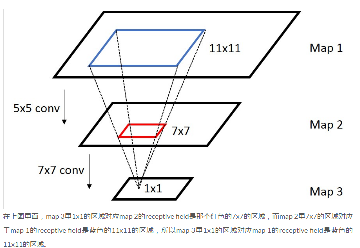

### googLeNet-v3


#### 1. googLeNet in the SiamFC++：

```
class Inception3(nn.Module):
    r"""
    GoogLeNet

    Hyper-parameters
    ----------------
    pretrain_model_path: string
        Path to pretrained backbone parameter file,
        Parameter to be loaded in _update_params_
    crop_pad: int
        width of pixels to be cropped at each edge
    pruned: bool
        if using pruned backbone for SOT
    """

    def __init__(self, transform_input=False):
        super(Inception3, self).__init__()
        self.Conv2d_1a_3x3 = BasicConv2d(3, 32, kernel_size=3, stride=2)
        self.Conv2d_2a_3x3 = BasicConv2d(32, 32, kernel_size=3)
        self.Conv2d_2b_3x3 = BasicConv2d(32, 64, kernel_size=3, padding=1)
        self.Conv2d_3b_1x1 = BasicConv2d(64, 80, kernel_size=1)
        self.Conv2d_4a_3x3 = BasicConv2d(80, 192, kernel_size=3)
        self.Mixed_5b = InceptionA(192, pool_features=32)
        self.Mixed_5c = InceptionA(256, pool_features=64)
        self.Mixed_5d = InceptionA(288, pool_features=64)
        self.Mixed_6a = InceptionB(288)
        self.Mixed_6b = InceptionC(768, channels_7x7=128)
        self.Mixed_6c = InceptionC(768, channels_7x7=160)
        self.Mixed_6d = InceptionC(768, channels_7x7=160)
        self.Mixed_6e = InceptionC(768, channels_7x7=192)

        # The last stage is not used in our experiment, resulting in faster inference speed.
        # self.Mixed_7a = InceptionD(768)
        # self.Mixed_7b = InceptionE(1280)
        # self.Mixed_7c = InceptionE(2048)
        # self.fc = nn.Linear(2048, num_classes)

        # Parameters are loaded, no need to initialized
        # for m in self.modules():
        #     if isinstance(m, nn.Conv2d) or isinstance(m, nn.Linear):
        #         import scipy.stats as stats
        #         stddev = m.stddev if hasattr(m, 'stddev') else 0.1
        #         X = stats.truncnorm(-2, 2, scale=stddev)
        #         values = torch.as_tensor(X.rvs(m.weight.numel()),
        #                                  dtype=m.weight.dtype)
        #         values = values.view(m.weight.size())
        #         with torch.no_grad():
        #             m.weight.copy_(values)
        #     elif isinstance(m, nn.BatchNorm2d):
        #         nn.init.constant_(m.weight, 1)
        #         nn.init.constant_(m.bias, 0)

        self.channel_reduce = nn.Sequential(
            nn.Conv2d(768, 256, 1),
            nn.BatchNorm2d(256, eps=0.001),
        )

    def forward(self, x, bbox=torch.tensor([])):
        # RGB -> BGR, [0, 255] -> [-1, 1]
        bias = 255 / 2
        x_ch0 = (torch.unsqueeze(x[:, 2], 1) - bias) / bias
        x_ch1 = (torch.unsqueeze(x[:, 1], 1) - bias) / bias
        x_ch2 = (torch.unsqueeze(x[:, 0], 1) - bias) / bias
        x = torch.cat((x_ch0, x_ch1, x_ch2), 1)
        # N x 3 x 299 x 299
        x = self.Conv2d_1a_3x3(x)
        # N x 32 x 149 x 149
        x = self.Conv2d_2a_3x3(x)
        # N x 32 x 147 x 147
        x = self.Conv2d_2b_3x3(x)
        # N x 64 x 147 x 147
        x = F.max_pool2d(x, kernel_size=3, stride=2)
        # N x 64 x 73 x 73
        x = self.Conv2d_3b_1x1(x)
        # N x 80 x 73 x 73
        x = self.Conv2d_4a_3x3(x)
        # N x 192 x 71 x 71
        # max_pool2d pruned for SOT adapdation
        # x = F.max_pool2d(x, kernel_size=3, stride=2)
        # N x 192 x 35 x 35
        x = self.Mixed_5b(x)
        # N x 256 x 35 x 35
        x = self.Mixed_5c(x)
        # N x 288 x 35 x 35
        x = self.Mixed_5d(x)
        # N x 288 x 35 x 35
        x = self.Mixed_6a(x)
        # N x 768 x 17 x 17
        x = self.Mixed_6b(x)
        # N x 768 x 17 x 17
        x = self.Mixed_6c(x)
        # N x 768 x 17 x 17
        x = self.Mixed_6d(x)
        # N x 768 x 17 x 17
        x = self.Mixed_6e(x)
        # N x 768 x 17 x 17

        # cropping to alleviate
        x = x[:, :, 4:-4, 4:-4]

        x = self.channel_reduce(x)
        return x
```

#### 2. googlenet中的原始图片ROI映射到feature map：
参考https://zhuanlan.zhihu.com/p/24780433

对于卷积或者池化层上层和下层中心位置的映射关系可以用如下公式表达：
$$p_i = s_i * p_{i+1} + ((k_i - 1) / 2 - padding)$$

**googLeNet-v3网络：**
若input_size: (127, 127), 则output_size: (13, 13)

*Conv2d_1a*:  kernel=3, stride=2 (63, 63)       
$p_i = 2 * p_{i+1} + 1$

*Conv2d_2a*:  kernel=3, stride=1 (61, 61)
$p_i = p_{i+1} + 1$

*Conv2d_2b*:  kernel=3, stride=1, padding=1 (61, 61)


*max_pool2d*:  kernel_size=3, stride=2 (30, 30)
$p_i = 2 * p_{i+1} + 1$


*Conv2d_3b*:  kernel=1, stride=1  (30, 30)


*Conv2d_4a*:  kernel=3, stride=1  (28, 28)
$p_i = p_{i+1} + 1$


*Mixed_5b* / *Mixed_5c* / *Mixed_5d* (Inception A):  kernel_size=1, stride=1 (28, 28)


*Mixed_6a* (Inception B): kernel=3, stride=2 (13, 13)
$p_i = 2 * p_{i+1} + 1$


*Mixed_6b* / *Mixed_6c* / *Mixed_6d* / *Mixed_6e* (Inception C):  kernel=1, stride=1 (13, 13)

级联后： $p_1 = 8 * p_{final} + 13$