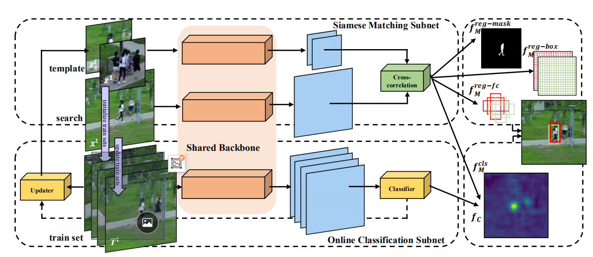
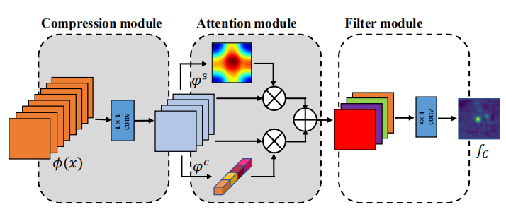

## Discriminative and Robust Online Learning for Siamese Visual Tracking
AAAI/2020

### 1. Introduction
"We propose a parallel framework to integrate offline-trained siamese networks with a
lightweight online module to enhance the discriminative capability."
Code:https://github.com/shallowtoil/DROL.

提出了一个结合“离线训练的孪生网络”和“在线更新模块”的并行框架，来增强辨别力。另外，在孪生网络中应用一个简单的模板更新策略，用来处理对象的形变。

具体来说，“离线训练的孪生网络”用于对象回归（object regression），“在线更新的分类器”用于处理干扰物。
在线训练的分类器，充分利用了背景信息，并用跟踪过程中产生的新数据来更新网络。

Three Siamese baselines: SiamFC、SiamRPN++、SiamMask。

### 2. Proposed Method
跟踪可以视为找到一个最佳位置使下列算式的值最小：
$$L(w)=\sum^m_{j=1}r(f(x_j;w),y_j)+\sum_k\lambda_k||w_k||^2$$

#### 2.1 Siamese Matching Subnet
基于孪生网络的分类：
$$f_M^{cls}(x,z)=\phi(x)*\phi(z)+b$$

基于孪生网络的回归with different heads：
- SiamFC:
$$f_M^{reg-fc}(x,z)=\phi(x)*\phi(\hat{z}),\hat{z}∈\{z^i|i=1,2,3\}$$
- RPN head(SiamRPN++):
$$f_M^{reg-box}(x,z)=[\phi(x)]^{reg-box}*[\phi(z)]^{reg-box}$$
- Mask head(SiamMask):
$$f_M^{reg-mask}(x,z)=[\phi(x)]^{reg-mask}*[\phi(z)]^{reg-mask}$$

#### 2.2 Discriminative Online Classification
L2 Loss：
$$r_C(f,y_i)=||f_C-y_i||^2$$
空间和通道上的数据不平衡降低了模型的区分能力，因此用在线训练的attention，是分类器在搜索区域中注重潜在目标所在的位置。
为了保证跟踪的速度，轻量的在线分类子网络用了3层卷积神经网络。

跟踪过程中，灰色区域是固定的。在线分类子网络：compression module（给backbone出来特征降维的）、attention module（解决正负样本不平衡）、Filter module

牛顿高斯下降（Newton-Gaussian descent ）比随机梯度下降更适合在线学习，由于收敛速度比较快。
梯度公式：
$$\frac{\partial L_C(w)}{\partial w}=\sum^m_{j=1} \frac{\partial f_C(w)}{\partial w}(f(x_j)-y_j)+\sum_k\lambda_kw_k$$
$$L_w=||r(w)||^2,r_j(w)=f(x_j)-y_j$$

$\varphi^s$和$\varphi^c$分别是空间注意力和通道注意力。$\varphi^s$经过全局平均池化和两个全连接层得到，$\varphi^c$经通道平均化后再用softmax。

分类器的得分图用三插值还原成siam matching network的分类图的大小。
两部分的分类图加权结合：
$$\tilde{f}_C(x;w)=\lambda f_C(x;w)+(1-\lambda)f_M^{cls}(x,z;w)$$

**Online learning**
用第一帧经过数据增强后（产生30个初始训练样本），初始化整个分类器，尺寸为255×255。对后续帧来说，前两个层保持固定，只有第三个卷积层会更新。
Maximal batch size：250。替换最不相似的来添加下一帧。遇到hard negative samples时，加倍学习率。

#### 2.2 Template Update
短期模板表示成$z_s$，长期模板表示成$z^1$，即第一帧模板。
Short-term template：
$$z_s=warp(arg \ max_x f_C(x;w)*1_{f_C>\tau_c})$$
$warp(·)$指从搜索区域上剪一个跟template大小一样的图片。$\tau_c$是滤波器的阈值，一直掉低质量的template。
$$z^{'}=\begin{cases}
z_s, & IoU(\hat{f}_M^{reg}(z_s), \hat{f}_M^{reg}(z^1))≥v_r\\
z^1, & otherwise
\end{cases}$$

### 3. Experiment

VOT2018-LT: Pre 0.687, Re 0.650
UAV123: AUC 0.652, Pr 0.855
TrackingNet: AUC 0.746, Pr 0.708, NPr 0.817
LaSOT: Success 0.537, NPr 0.624